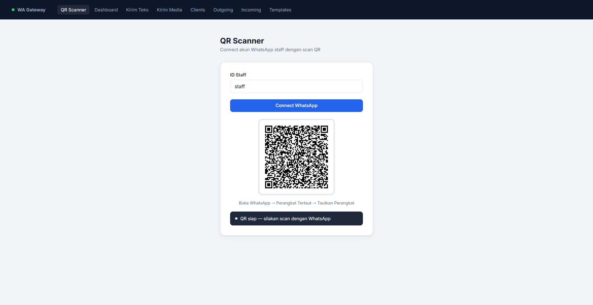
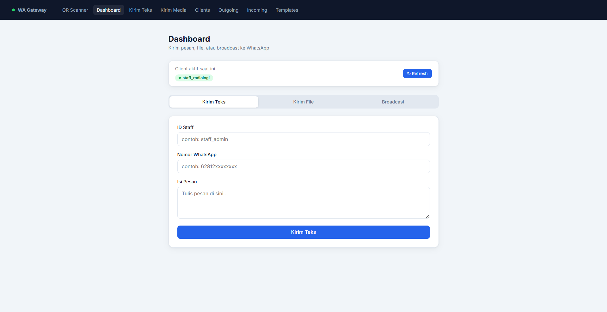
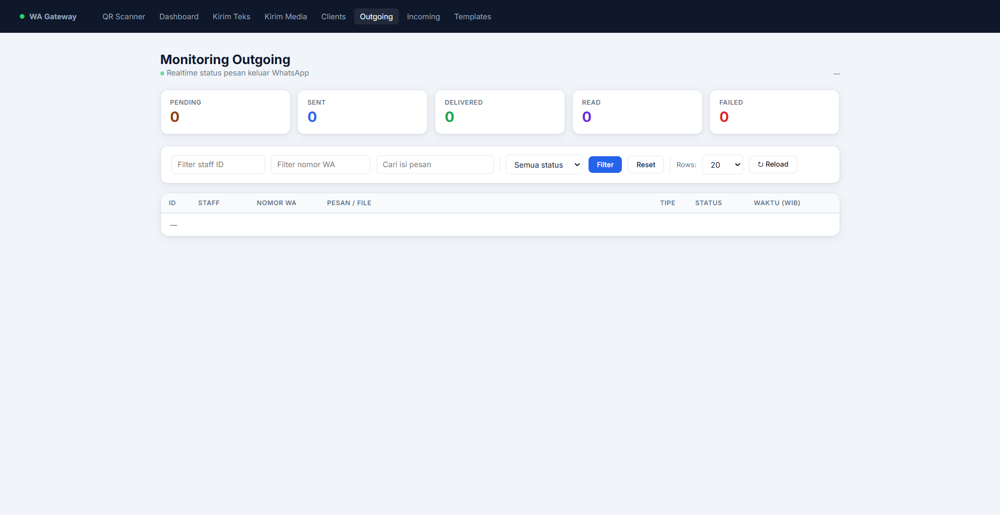

# WhatsApp Multi-Staff Gateway

A self-hosted WhatsApp gateway supporting **multiple staff accounts** simultaneously. Each staff member gets an independent WhatsApp Web session, QR scan, message queue, and delivery tracking — all via a single Node.js server.

Built on [whatsapp-web.js](https://github.com/pedroslopez/whatsapp-web.js) + Express + Socket.IO + MySQL.

---

## Features

- **Multi-staff** — unlimited staff accounts, each with an isolated WA session
- **Queue system** — insert messages into DB, process via cron trigger
- **Scheduled messages** — `scheduled_at` field for future delivery
- **Immediate send** — send text / media / broadcast directly (WA client must be active)
- **Incoming messages** — stored in DB + forwarded to webhook
- **Outgoing webhook** — push incoming messages & delivery ACKs to any URL
- **API Key auth** — optional `x-api-key` / `Bearer` header / `?api_key=` query protection
- **Rate limiting** — 30 req/min on direct-send endpoints
- **Auto-retry** — configurable retry attempts before marking message as `failed`
- **Message templates** — save and reuse message templates via API
- **Real-time dashboard** — Socket.IO events for live status updates in browser
- **Health check** — `/api/health` endpoint for uptime monitoring
- **Session persistence** — auto-reconnect all staff sessions on server restart

---

## Screenshots

| QR Scanner | Send Dashboard | Outgoing Monitor |
|---|---|---|
|  |  |  |

**QR Scanner** — enter staff ID, scan QR with WhatsApp to connect session.  
**Send Dashboard** — send text / file / broadcast with active staff selector.  
**Outgoing Monitor** — real-time status tracking with filter by staff, number, message, status.

---

## Architecture

```
Browser ←──── Socket.IO ────→ Express Server ←──── MySQL
                                    │
                            whatsapp-web.js
                           (Puppeteer headless)
                                    │
                            WhatsApp Web API
```

---

## Prerequisites

- **Node.js** >= 18.0.0
- **MySQL** 5.7+ or **MariaDB** 10.3+
- **Chromium** — bundled automatically by Puppeteer on first install

---

## Installation

```bash
git clone https://github.com/yourname/wa-multi-staff.git
cd wa-multi-staff
npm install
cp .env.example .env
# Edit .env with your database credentials and secrets
```

---

## Database Setup

```sql
CREATE DATABASE simrs_wa CHARACTER SET utf8mb4 COLLATE utf8mb4_unicode_ci;
USE simrs_wa;

CREATE TABLE IF NOT EXISTS wa_outgoing (
  id           BIGINT AUTO_INCREMENT PRIMARY KEY,
  staff_id     VARCHAR(100) NOT NULL,
  wa_number    VARCHAR(50)  NOT NULL,
  message      TEXT,
  msg_type     ENUM('text','file','pdf') DEFAULT 'text',
  status       ENUM('pending','sent','delivered','read','failed','not_registered') DEFAULT 'pending',
  message_id   VARCHAR(255) NULL,
  file_name    VARCHAR(255) NULL,
  file_mime    VARCHAR(100) NULL,
  file_data    LONGTEXT     NULL,
  retry_count  INT          DEFAULT 0,
  caption      TEXT         NULL,
  scheduled_at DATETIME     NULL,
  created_at   DATETIME     DEFAULT NOW(),
  updated_at   DATETIME     DEFAULT NOW() ON UPDATE NOW(),
  INDEX idx_outgoing_status_scheduled (status, scheduled_at)
) ENGINE=InnoDB DEFAULT CHARSET=utf8mb4;

CREATE TABLE IF NOT EXISTS wa_incoming (
  id          BIGINT AUTO_INCREMENT PRIMARY KEY,
  staff_id    VARCHAR(100) NOT NULL,
  from_number VARCHAR(50),
  body        TEXT,
  msg_type    VARCHAR(30)  DEFAULT 'chat',
  has_media   TINYINT(1)   DEFAULT 0,
  created_at  DATETIME     DEFAULT NOW()
) ENGINE=InnoDB DEFAULT CHARSET=utf8mb4;

CREATE TABLE IF NOT EXISTS wa_templates (
  id         INT AUTO_INCREMENT PRIMARY KEY,
  name       VARCHAR(100) NOT NULL UNIQUE,
  content    TEXT         NOT NULL,
  created_at DATETIME     DEFAULT NOW()
) ENGINE=InnoDB DEFAULT CHARSET=utf8mb4;
```

If you're upgrading an existing installation, run the migration script instead:

```bash
mysql -u root -p simrs_wa < schema-update.sql
```

---

## Configuration

| Variable | Default | Description |
|---|---|---|
| `PORT` | `3030` | HTTP server port |
| `DB_HOST` | `localhost` | MySQL host |
| `DB_USER` | `root` | MySQL user |
| `DB_PASSWORD` | _(empty)_ | MySQL password |
| `DB_NAME` | `simrs_wa` | MySQL database name |
| `API_KEY` | _(empty)_ | API key for all `/api/*` endpoints. Leave empty to disable auth |
| `CRON_TOKEN` | `RAHASIA_CRON_123` | Secret token for `/api/run-cron` |
| `WEBHOOK_URL` | _(empty)_ | URL to receive incoming messages & delivery ACKs |
| `MAX_RETRY` | `3` | Max retry attempts before marking message as `failed` |
| `QUEUE_DELAY_MIN` | `2000` | Min delay (ms) between queue messages |
| `QUEUE_DELAY_MAX` | `5000` | Max delay (ms) between queue messages |
| `AUTO_REPLY_ENABLED` | `false` | Reply with static text to every incoming message |
| `AUTO_BOT_AI_ENABLED` | `false` | AI bot integration (stub — implement `generateAiReply`) |
| `CHAT_LOG_FILE` | `chats-log.jsonl` | Path for incoming message log file |

---

## Running

```bash
node server-new.js
```

Then open:

| URL | Purpose |
|---|---|
| `http://localhost:3030/qr-scanner.html` | Connect a staff's WhatsApp |
| `http://localhost:3030/wa-dashboard.html` | Send messages / broadcast |
| `http://localhost:3030/outgoing-dashboard.html` | Monitor outgoing messages |
| `http://localhost:3030/api-docs.html` | Interactive API documentation |
| `http://localhost:3030/api/health` | Health check |

Enter any `staff_id` (e.g. `staff1`, `dr-ahmad`) in the QR scanner, scan the QR with WhatsApp, and the session is ready.

> Sessions are saved to `.wwebjs_auth/session-{staff_id}/` and auto-restored on server restart — no re-scan needed.

---

## API Reference

Interactive docs available at `http://localhost:3030/api-docs.html` (Swagger UI).

### Authentication

When `API_KEY` is set, pass it via one of:

```
x-api-key: your-key
Authorization: Bearer your-key
?api_key=your-key
```

The `/api/health` endpoint is always public.

### Endpoints

#### Health & Status

| Method | Path | Description |
|---|---|---|
| `GET` | `/api/health` | Server health, DB status, active client count |
| `GET` | `/api/clients` | List connected staff IDs |
| `GET` | `/api/queue/stats` | Message count grouped by status |

#### Immediate Send (WA client must be active)

| Method | Path | Description |
|---|---|---|
| `POST` | `/api/send-text` | Send text message immediately |
| `POST` | `/api/send-media` | Send file/image immediately (base64) |
| `POST` | `/api/broadcast-text` | Send text to multiple numbers |

#### Queue (insert to DB, deliver via cron)

| Method | Path | Description |
|---|---|---|
| `POST` | `/api/queue-text` | Queue a text message |
| `POST` | `/api/queue-pdf` | Queue a PDF file |
| `POST` | `/api/queue-media` | Queue any media file |
| `GET` | `/api/run-cron?token=` | Process up to N pending messages |
| `POST` | `/api/queue/reset-failed` | Reset failed messages back to pending |

#### Messages

| Method | Path | Description |
|---|---|---|
| `GET` | `/api/outgoing` | List outgoing messages (paginated) |
| `GET` | `/api/incoming` | List incoming messages (paginated) |

#### Templates

| Method | Path | Description |
|---|---|---|
| `GET` | `/api/templates` | List all templates |
| `POST` | `/api/templates` | Create/update template |
| `DELETE` | `/api/templates/:id` | Delete template |

#### Session

| Method | Path | Description |
|---|---|---|
| `POST` | `/api/logout` | Logout and destroy a staff's WA session |

---

## Socket.IO Events

| Direction | Event | Payload | Description |
|---|---|---|---|
| Client → Server | `check-auth` | `{ id }` | Initiate WA session for staff |
| Server → Client | `qr:{id}` | PNG data URL | QR code to scan |
| Server → Client | `connected:{id}` | `{ status: 'connected' }` | Session ready |
| Server → Client | `wa-reconnecting:{id}` | `{ reason }` | Session disconnected, reconnecting |
| Server → Client | `wa-status-update` | `{ messageId, status }` | Delivery ACK update |
| Server → Client | `wa-new-outgoing` | row object | New outgoing message inserted |
| Server → Client | `wa-new-incoming` | `{ staff_id, from, body, type }` | Incoming message |
| Server → Client | `wa-client-logout` | `{ id }` | Staff logged out |

---

## Webhook Payload

When `WEBHOOK_URL` is set, the server POSTs JSON to it on two events:

**Incoming message:**
```json
{
  "event": "incoming",
  "staff_id": "staff1",
  "from": "628123456789",
  "body": "Hello",
  "type": "chat"
}
```

**Delivery ACK:**
```json
{
  "event": "ack",
  "message_id": "true_628xxx@c.us_ABCDEF123",
  "status": "delivered"
}
```

Status values: `sent` (1), `delivered` (2), `read` (3).

---

## Phone Number Normalization

Numbers are normalized before sending:

- Strip all non-digits
- If starts with `0` → replace with `62` (Indonesia)
- Append `@c.us`

Examples: `08123456789` → `628123456789@c.us`, `+62812...` → `62812...@c.us`

---

## Production Notes

- Set a strong `API_KEY` and `CRON_TOKEN` in `.env`
- `file_data` in `wa_outgoing` stores base64-encoded files — can be very large. Avoid `SELECT *` on PDF rows
- `clients` object is in-memory. If server restarts, pending queue won't process until sessions reconnect
- Use a process manager like PM2: `pm2 start server-new.js --name wa-gateway`
- Set up a cron job or external scheduler to call `/api/run-cron` periodically

---

## Avoiding WhatsApp Bans

WhatsApp may ban numbers that exhibit spammy behavior. Follow these guidelines to keep your accounts safe.

### Recommended Number Types

| Type | Risk | Notes |
|---|---|---|
| WA Business (6+ months old) | Low | Best choice |
| WA Personal (1+ year old) | Low–Medium | Generally safe |
| WA Business (newly registered) | High | Warm up first |
| Any number < 3 months old | Very high | Avoid for bulk sending |

### Warm-up Schedule

Never blast from a fresh number. Build trust gradually:

| Week | Max messages/day |
|---|---|
| 1 | 20 |
| 2 | 50 |
| 3 | 100 |
| 4+ | Normal volume |

Only send to contacts who have saved your number during warm-up.

### Safe `.env` Config

```env
QUEUE_DELAY_MIN=3000    # minimum 3s between messages
QUEUE_DELAY_MAX=8000    # random up to 8s — mimics human behavior
MAX_RETRY=3
```

Do **not** set delays below 2000ms. WhatsApp detects robotic sending patterns.

### Daily Volume Limits (conservative)

| Account type | Safe daily limit |
|---|---|
| New / warming up | 20–50 |
| Personal (established) | 200–300 |
| WA Business (verified) | 500+ |

### Best Practices

- **Spread load** — use 3–5 staff accounts instead of blasting all from one number
- **Vary message text** — do not send 100 identical messages; use templates with slight variation
- **Avoid short URLs** (bit.ly, tinyurl) — flagged as spam by WhatsApp
- **Clean your list** — high `not_registered` rate signals spam behavior; remove invalid numbers
- **Don't cold-blast** — send only to people who expect your message or have consented

---

## License

MIT
